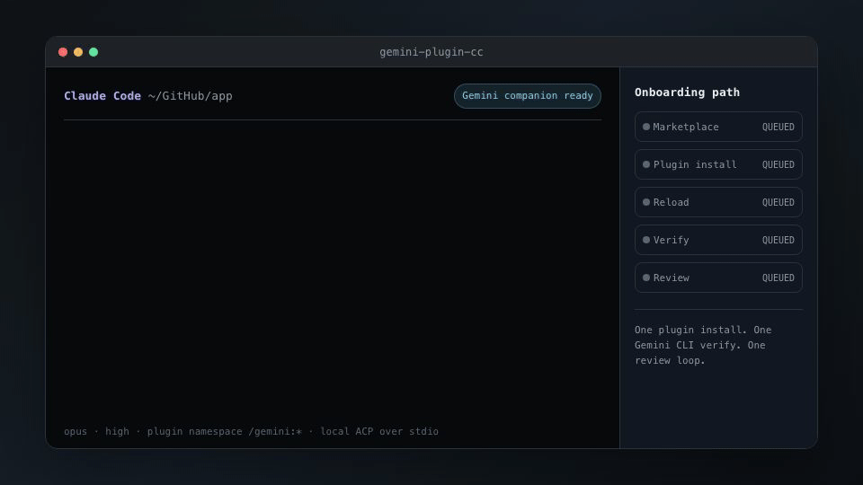

# Claude Code 的 Gemini 插件

[English](README.md) | 简体中文



[](LICENSE)
[](package.json)
[](tests/)

在 Claude Code 里直接用 [Google 的 Gemini CLI](https://github.com/google-gemini/gemini-cli)。
可以做 code review、对抗 review，也可以把调查和修复交给 Gemini。用的都是你当前的仓库。

插件通过 `gemini --acp` 和 Gemini CLI 通信，走 JSON-RPC。Claude 和 Gemini 在同一份 checkout 上各干各的。

两个 review 命令不改代码。`/gemini:rescue` 默认可以写工作区。

## 安装

在 Claude Code 会话里运行：

```text
/plugin marketplace add millerweng/gemini-plugin-cc
/plugin install gemini@gemini-plugin-cc
/reload-plugins
/gemini:setup --verify
```

需要 Node.js 18.18 以上，还需要 Gemini CLI 的访问权限（OAuth、API key、Vertex AI 或 gateway）。
`/gemini:setup` 会检查这两项。CLI 没装的话，它会问你要不要装固定版本：
`npm install -g @google/gemini-cli@0.38.2`。

更新分两步：先 `claude plugin marketplace update gemini-plugin-cc`，再 `claude plugin update gemini`，
然后重启会话。更新是按版本号比对的。如果它说没什么可更新，检查 marketplace 上的版本号是不是高于
`~/.claude/plugins/installed_plugins.json` 里记录的那个。

## 命令

| 命令 | 作用 |
|---|---|
| `/gemini:review` | review 当前 diff，输出结构化 findings |
| `/gemini:adversarial-review` | 质疑实现方式、设计和假设 |
| `/gemini:rescue` | 把调查、诊断或修复交给 Gemini |
| `/gemini:transfer` | 把当前会话转成可 resume 的 Gemini 会话 |
| `/gemini:setup` | 检查环境，或者用 `--init` 一次配完所有设置 |
| `/gemini:status` | 查看进行中和最近的任务，以及每个运行中的任务是否还活着 |
| `/gemini:result` | 查看已完成任务的输出 |
| `/gemini:cancel` | 取消一个后台任务 |

直接说「gemini review」或者「adversarial review」，Claude 就会跑对应的 review。
其他命令都要打斜杠。Claude 不会自己发起 review，因为一次 review 要花额度和几分钟。

```text
/gemini:review --wait
/gemini:adversarial-review --base main challenge the retry logic
/gemini:rescue --background 查一下 dashboard 的 N+1 查询
/gemini:status --wait
/gemini:result
```

## Review

两个 review 命令的 flag 一样。flag 后面可以跟一段文字，说明这次重点看什么。

| Flag | 说明 |
|---|---|
| `--base <ref>` | 和这个 ref 比 branch diff，工作区脏了也照比 |
| `--scope auto\|working-tree\|branch` | 强制指定 review 什么，默认 `auto` |
| `--cwd <path>` | review 另一个 checkout，比如当前会话不在的那个 worktree |
| `--multi[=<lens,...>]` | 分三路窄范围跑，再把 findings 合并 |
| `--model <alias>` | 指定模型，别名见下面 |
| `--show-reasoning` | 输出里带上 Gemini 的推理过程 |
| `--show-files` | 列出这次 review 实际覆盖了哪些文件，以及哪些没覆盖到 |
| `--max-diff-bytes <size>` | 只对这次抬高截断上限（`512kb`、`1mb`，或者直接给字节数）|
| `--progress` | 输出被重定向时也打印进度行 |
| `--wait` / `--background` | 前台跑，或者转后台 |

两个都不写时，Claude 会估算这次 review 的规模，再建议用哪个。

**review 什么**，优先级从高到低：

1. `--scope working-tree` 或 `--scope branch`
2. `--base <ref>`
3. 未提交的改动，前提是工作区是脏的
4. 和固定 base 比 branch diff（见 `--set-review-base`）
5. 和自动检测出的默认分支比 branch diff

自动检测出的 base 如果覆盖超过 40 个文件，输出里会标出来。这通常说明范围比你想 review 的改动大得多。

diff 超过预算时只会发一部分，报告里会写明撞的是哪个预算。
加 `--show-files` 就把这句话变成两份明确的清单：这次看了哪些文件，哪些没看到。

预算默认 256 KB。单次抬高用 `--max-diff-bytes 512kb`，
整个 workspace 用 `/gemini:setup --set-max-diff-bytes 512kb`。

想在花掉一次 review 之前先知道会不会截断：

```bash
node "$CLAUDE_PLUGIN_ROOT/scripts/gemini-companion.mjs" review-scope
```

它会报出 diff 多大、当前预算是多少、会不会截断、以及改动最多的那几个文件。
两个 review 命令在问你「前台还是后台」之前，自己就会先跑一遍。

### 多路 review

一次 review 要同时权衡所有问题。prompt 里的评分规则又会让 Gemini 只报它认为最严重的那个，
其余的丢掉。`--multi` 把同一份 diff 分三路跑，每路只看一类问题：

| Lens | 看什么 |
|---|---|
| `correctness` | 逻辑错误、边界、没处理的错误路径、被破坏的不变量 |
| `security` | 认证授权漏洞、隔离失效、注入、密钥泄露 |
| `resilience` | 竞态、幂等性、部分失败、回滚和迁移风险 |

两路不同 lens 报的问题，如果位置相差不超过五行，描述也接近，就会合并。
合并后的 finding 标成 `confirmed by 2 lenses`，排在前面。两路都发现，这正是 `--multi` 想要的信号。

合并不丢东西。没被选中的那份描述保留在 `Also reported as` 下面。

某一路失败了，它会被丢掉并给出警告，跑通的那几路照常报。
命令退出码非零，免得 CI 把残缺的 review 当成通过。

三路是串行跑的，耗时大约是单路的三倍，建议配 `--background`。
想少跑几路就写 `--multi=security,resilience`。

## Rescue

`/gemini:rescue` 把调查、诊断或修复交给 `gemini-rescue` subagent。
默认用 Gemini CLI 的 `--yolo --sandbox` 模式，可以写文件，范围限制在当前 worktree。

| Flag | 说明 |
|---|---|
| `--plan` | 只读，Gemini 只给方案，不动手 |
| `--background` / `--wait` | 转后台，或前台等它跑完（默认前台） |
| `--resume` / `--fresh` | 接着这个仓库上一个 Gemini 线程，或者重开一个 |
| `--model <alias>` | 指定模型 |
| `--effort low\|medium\|high` | 思考强度（参数收下了，等上游 ACP 支持） |

| 别名 | 模型 |
|---|---|
| `pro`、`pro-3` | `gemini-3.1-pro-preview` |
| `flash` | `gemini-3-flash-preview` |
| `flash-lite` | `gemini-3.1-flash-lite-preview` |
| `2.5-pro`、`2.5-flash`、`2.5-flash-lite` | 对应的 Gemini 2.5 模型 |
| `auto`、`auto-2.5` | `auto-gemini-3`、`auto-gemini-2.5` |

也可以直接写模型 ID。跑可能改文件的 rescue 之前，先 commit 或者 stash。

```bash
/gemini:rescue --plan 梳理 orders 接口从 API 到数据库的数据流
/gemini:rescue --model flash 诊断 worker pool 的内存泄漏
```

## 审查门

`/gemini:setup --enable-review-gate` 会装一个 `Stop` hook。
Claude 每次要结束回答之前，先让 Gemini review 一遍。

如果 gate 连不上 Gemini，它会挡住并说明要修什么，不会默默放行。用 `--disable-review-gate` 关掉。

gate 拿到的是 Claude 最后一段回复和仓库当前状态，不是这一轮的 diff。
会话很长、工作区又有未提交改动时，它分不清哪些改动属于这一轮。

## 配置

**一次问完所有配置。** `--init` 会挨个问你每项设置，然后把答案写进去。
随时可以重跑，每个答案都会覆盖原值，而且当前的选项排在第一个：

```bash
/gemini:setup --init
```

**固定 review base。** 自动检测跟着 `origin/HEAD` 走。
如果你的分支最后合进一个长期存在的集成分支，merge-base 会落得很靠后，
每次 review 都会把这之后的所有改动算进来：

```bash
/gemini:setup --set-review-base origin/internal-release   # 用 --clear-review-base 撤销
```

ref 在设置时就解析，写错了当场报错。

每个 git worktree 是独立的 workspace。worktree 自己没设 base，就继承主 checkout 的。

固定的 base 只在做 branch review 时提供 ref。有未提交改动时，还是优先 review 未提交的部分。

**抬高 diff 预算。** 超过 256 KB 的 review 只会发一部分 diff。改动经常更大的话可以调高：

```bash
/gemini:setup --set-max-diff-bytes 512kb   # 用 --clear-max-diff-bytes 撤销
```

可以写后缀（`512kb`、`1mb`），也可以直接给字节数。写错的值在设置时就报错，不会被悄悄忽略。

一步一步往上调。prompt 大太多的话，可能整个 turn 都花在推理上、最后什么都不返回 —— 那比一次「明说自己截断了」的 review 更糟。

**让 review 一直列出覆盖了哪些文件。** 在这个 workspace 里把 `--show-files` 设成常开，
这样截断的时候不用你记得加参数，报告自己就会写明漏了什么：

```bash
/gemini:setup --enable-show-files   # 用 --disable-show-files 撤销
```

`--show-files` 仍然可以只对单次生效。设置开着时，用 `--hide-files` 让某一次不列。

worktree 的继承规则和 review base 一样。worktree 自己关掉的，就保持关闭。

**配置写在哪。** setup 会打印它写到了哪个文件。
配置放在 `CLAUDE_PLUGIN_DATA` 下面。这个变量由 Claude Code 设置，普通 shell 里没有。
所以手动跑 companion 脚本时，配置会写进一个临时目录，插件不会去读它。

**任务超时。** 默认 30 分钟。改法：`export GEMINI_TASK_TIMEOUT_MS=3600000`。

**认证。** 配在 `~/.gemini/settings.json` 的 `selectedType` 里：

- `oauth-personal`：先在终端里跑一次 `gemini` 完成授权
- `gemini-api-key` / `google-api-key`：还要设对应的环境变量
- `vertex-ai`：还要设 `GOOGLE_CLOUD_PROJECT` 和 `GOOGLE_CLOUD_LOCATION`
- `gateway`

## 运行方式

插件会起一个共享的 ACP broker。多条命令复用同一个 Gemini 进程，进程活到 Claude Code 会话结束。
broker 忙或者起不来时，自动退回到直接起一个 Gemini CLI 进程。

任务状态存在工作区外面。`--resume` 读的就是它，最近 20 个会话会保留。

`/gemini:transfer` 把当前 Claude Code 会话写成 Gemini 原生的 JSONL 聊天记录，
放在 `~/.gemini/tmp/<project>/chats/` 下，所以 `gemini --list-sessions` 和 `--resume` 都能找到。
写的时候会去掉 Claude Code 的框架标记，每个工具调用压成一行。
加 `--include-tool-output` 可以把工具返回的内容也带上。

和 Codex 插件同时装没问题。命名空间不同，运行时也各自独立。

## Fork 与出处

本仓库 fork 自 [m-ghalib/gemini-plugin-cc](https://github.com/m-ghalib/gemini-plugin-cc)，
它又源自 OpenAI 的 [Codex plugin for Claude Code](https://github.com/openai/codex-plugin-cc)。
broker 生命周期、状态管理、任务控制、渲染和参数解析都来自那份代码，
完整出处见 [NOTICE](NOTICE)。

这个 fork 改了什么，都记在 [CHANGELOG](plugins/gemini/CHANGELOG.md) 里：OAuth 就绪检测、
review 范围判定、多路 review、`/gemini:transfer`、固定 review base。插件本身的功劳归上游。

Apache-2.0，见 [LICENSE](LICENSE)。
